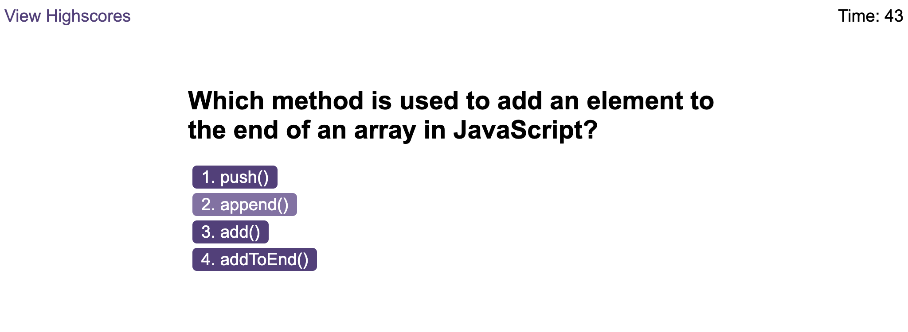

# Timed Coding Quiz
This project is a coding assessment that a is combination of multiple-choice questions and interactive coding challenges. The results will be displayed when time is over or all the questions have been answered.

- **Visit** the deployed webapp at : https://gsgghotra.github.io/timed-coding-quiz/

## Table of Contents

1. [Introduction](#introduction)
2. [Screenshots](#screenshots)

## Introduction
    
**Purpose:** Code quiz that contains the following requirements:

- A start button that when clicked a timer starts and the first question appears.

- Questions contain buttons for each answer.

- When answer is clicked, the next question appears.

- If the answer clicked was incorrect then subtract time from the clock.

- The quiz should end when all questions are answered or the timer reaches 0.

- When the game ends, it should display their score and give the user the ability to save their initials and their score.

## Screenshots
- **Index Page**:

- **Questions Page**:

- **Initials Field validation**: 0-3 characters only

- **High Scores**: from highest to lowest

